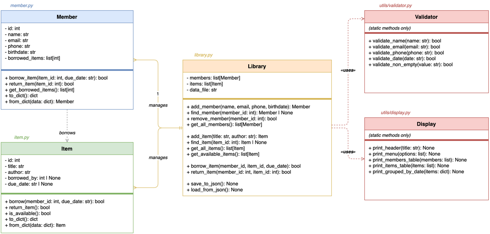
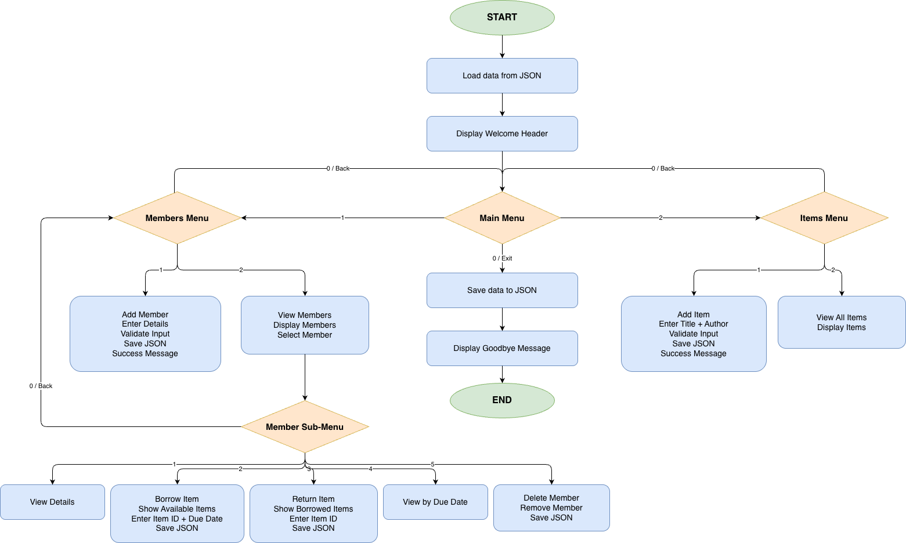

# Student Library — Membership & Resource Management System

 

A console-based library management system built in Python 3, developed as part of **MIS501 Principles of Programming — Assessment 2: Scalable Programming in Practice** (Torrens University Australia).

---

## Scenario

> **Assessment 1 (Modules 1–4):** A single library member needed a simple console assistant to track borrowed items — their personal details, due dates, and returns — built using only fundamental Python (variables, lists, dictionaries, `while` loops, no OOP).

**Assessment 2 (Modules 1–8)** scales that prototype into a full multi-member system. The outdated single-user tool is redesigned using object-oriented programming principles — modularity, encapsulation, and abstraction — so the library can manage many members and items simultaneously, with data persisted to a JSON file.

---

## Features

- Register and manage multiple library members (name, email, phone, birthdate)
- Add items to the library catalogue (title, author)
- Borrow and return items with due date tracking
- View available items and member borrowing history
- Group borrowed items by due date
- Save and load all data from a JSON file
- Input validation for all user-entered data
- Formatted console output with tables and menus

---

## Architecture

The system is designed around five classes across three modules. See [`student_library_class_diagram.drawio`](student_library_class_diagram.drawio) for the editable source.



| Class | File | Responsibility |
| --- | --- | --- |
| `Library` | `library.py` | Main controller — manages members and items, handles borrowing operations, JSON persistence |
| `Member` | `member.py` | Stores member data; `borrow_item()`, `return_item()`, `get_borrowed_items()` |
| `Item` | `item.py` | Stores item data; `borrow()`, `return_item()`, `is_available()` |
| `Validator` | `utils/validator.py` | Static methods for validating name, email, phone, date inputs |
| `Display` | `utils/display.py` | Static methods for printing menus, tables, and grouped due-date views |

### Relationships

```text
Library  ──1:many──▶  Member
Library  ──1:many──▶  Item
Member   ─ borrows ─▶  Item
Library  ─ uses ──────▶  Validator
Library  ─ uses ──────▶  Display
```

---

## Flowchart



---

## Project Structure

```text
student-library2/
├── main.py                              # Entry point
├── library.py                           # Library class
├── member.py                            # Member class
├── item.py                              # Item class
├── utils/
│   ├── validator.py                     # Validator utility class
│   └── display.py                       # Display utility class
├── student_library_class_diagram.drawio # Class diagram
└── README.md
```

---

## Setup & Run

**Requirements:** Python 3.x

```bash
# 1. Clone the repository
git clone <repo-url>
cd student-library2

# 2. Create and activate virtual environment (optional)
python3 -m venv .venv
source .venv/bin/activate      # macOS/Linux
.venv\Scripts\activate         # Windows

# 3. Run the application
python main.py
```

---

## Team

| Name | GitHub |
| --- | --- |
| Ivan Bazhenov | [@sendhello](https://github.com/sendhello) |
| Takunda Audrey Shelter | [@AudreyShelly3](https://github.com/AudreyShelly3) |
| Renato Bustamante | |

---

## Assessment Context

| Field | Detail |
| --- | --- |
| Subject | MIS501 Principles of Programming |
| Assessment | Assessment 2 — Scalable Programming in Practice |
| Institution | Torrens University Australia |
| Language | Python 3 only |
| Concepts applied | OOP (encapsulation, inheritance, abstraction), modular design, file I/O, input validation |
| Modules covered | 1–8 |
